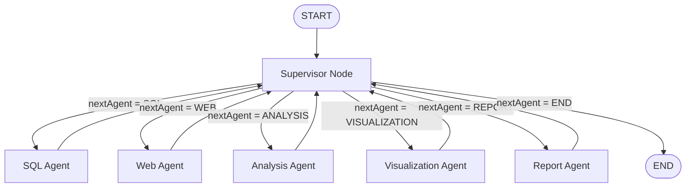

# 🤖 Agentic Business Intelligence System (ABI)

An AI-powered **multi-agent Business Intelligence platform** that enables **small businesses** and **non-technical users** to interact with their business data using natural language.

Instead of writing SQL queries or manually analyzing spreadsheets, users can simply ask questions like:

* *"What was our total revenue in May?"*
* *"Generate a PDF report for last month's sales."*
* *"Show a bar chart of monthly revenue."*
* *"What is today's petrol price?"*

The system intelligently decides which specialized AI agents should execute, gathers data from multiple sources, performs business analysis, generates visualizations, and creates professional reports.

---

# 🎯 Problem Statement

Small businesses often cannot afford dedicated teams of:

* Business Analysts
* Data Analysts
* SQL Developers
* Market Researchers

As a result, valuable business data remains underutilized.

In addition, many business owners come from non-technical backgrounds and cannot write SQL queries or use traditional BI tools.

The goal of this project is to make business intelligence accessible through natural language using an AI-driven multi-agent architecture.

---

# 💡 Solution

The Agentic Business Intelligence System acts as an autonomous Business Intelligence Assistant.

A user asks a question in natural language.

The system automatically:

* Understands the user's intent
* Determines which AI agents are required
* Retrieves business data from the database
* Fetches external market information when necessary
* Performs AI-powered business analysis
* Generates charts and visualizations
* Produces professional PDF reports

No SQL knowledge is required.

---

# 🚀 Features

* 🤖 Multi-Agent Architecture
* 🔄 LangGraph Workflow Orchestration
* 🧠 Intelligent Supervisor Agent
* 📊 AI Business Analysis
* 🗄️ Safe Read-Only SQL Generation
* 🌐 Real-Time Web Research
* 📈 Automatic Chart Generation
* 📄 Professional PDF Report Generation
* 💬 Natural Language Interface
* 🏗️ Modular & Scalable Architecture

---

# 🏗️ LangGraph Orchestration Architecture



The project is implemented using **LangGraph's StateGraph** following a **Supervisor-Orchestrator architecture**.

Unlike traditional pipelines, the system does **not** execute agents in a fixed order.

Instead, the Supervisor dynamically decides which specialized agent should execute next based on:

* User intent
* Current workflow state
* Previously generated outputs

Each agent performs a single responsibility, updates the shared state, and returns control to the Supervisor.

The workflow terminates only when the Supervisor routes execution to the `END` node.

---

# 🔄 Workflow

1. User submits a natural language query.

2. The Supervisor Node:

   * Classifies the query.
   * Examines the current workflow state.
   * Determines the next agent to execute.

3. LangGraph routes execution to the selected agent.

4. The selected agent performs its task and updates the shared state.

5. Control returns to the Supervisor.

6. The Supervisor decides whether another agent is required.

7. The workflow repeats until the Supervisor determines that sufficient information has been collected.

8. Execution ends.

---

# 🧠 Shared Workflow State

All agents communicate through a shared LangGraph state.

```text
ABIState
│
├── userQuery
├── sqlResult
├── webResult
├── analysisResult
├── visualizationResult
├── reportResult
├── nextAgent
└── finalResponse
```

---

# 🤖 AI Agents

## Supervisor Agent

Responsible for orchestrating the entire workflow.

Responsibilities:

* Understand user intent
* Inspect workflow state
* Select the next agent
* Prevent unnecessary agent execution
* Decide when the workflow should terminate

---

## SQL Agent

Responsibilities:

* Inspect database schema
* Generate safe read-only SQL queries
* Retrieve internal business data
* Return structured SQL results

---

## Web Agent

Responsibilities:

* Retrieve real-time external information
* Collect market trends
* Gather business-related news
* Provide supporting context

---

## Analysis Agent

Responsibilities:

* Combine SQL and Web data
* Generate business insights
* Explain trends
* Produce actionable recommendations

---

## Visualization Agent

Automatically generates visualizations such as:

* Bar Charts
* Line Charts
* Pie Charts
* Histograms

---

## Report Agent

Creates professional PDF reports containing:

* Executive Summary
* Business Insights
* Visualizations
* Recommendations

---

# 🛠️ Tech Stack

### Backend

* Node.js
* JavaScript

### AI Framework

* LangGraph.js
* OpenAI SDK
* NVIDIA NIM

### Database

* SQLite
* Turso

### Visualization

* Chart.js

### PDF Generation

* PDFKit

---

# 📂 Project Structure

```text
Agentic-Business-Intelligence-System
│
├── Agents/
│   ├── supervisorAgent.js
│   ├── SQLAgent.js
│   ├── webAgent.js
│   ├── analysisAgent.js
│   ├── visualizingAgent.js
│   └── reportAgent.js
│
├── Graph/
│   ├── graph.js
│   ├── nodes.js
│   ├── router.js
│   └── state.js
│
├── Schemas/
├── Tools/
├── prompts/
├── reports/
├── charts/
├── charts-config/
│
├── index.js
└── package.json
```

---

# ⚙️ Installation

```bash
git clone https://github.com/Krishna-958/Agentic-Business-Intelligence-System.git

cd Agentic-Business-Intelligence-System

npm install
```

---

# 🔑 Environment Variables

Create a `.env` file.

```env
NVIDIA_API_KEY=your_api_key

TURSO_DATABASE_URL=your_database_url

TURSO_AUTH_TOKEN=your_auth_token
```

---

# ▶️ Run the Project

```bash
node index.js
```

---

# 💬 Example Queries

```text
What was our total revenue in May?

Generate a PDF report for June sales.

Show a bar chart of monthly revenue.

Compare petrol prices with crude oil prices.

Why did our profit decrease this quarter?

What are the latest fuel price trends?
```

---

# 🎯 Target Users

* Small Business Owners
* Retail Businesses
* Startup Founders
* Non-Technical Users
* Business Analysts

---

# 🚀 Future Enhancements

* Retrieval-Augmented Generation (RAG)
* Human-in-the-Loop Approval
* Memory-enabled Agents
* Predictive Business Forecasting
* Interactive Dashboard
* Voice-based Queries
* Multi-language Support
* Cloud Deployment

---

# 🤝 Contributing

Contributions, suggestions, and feature requests are welcome.

Feel free to fork the repository and submit a pull request.

---

# 📄 License

This project is licensed under the MIT License.

---

## ⭐ If you found this project useful, consider giving it a Star!
